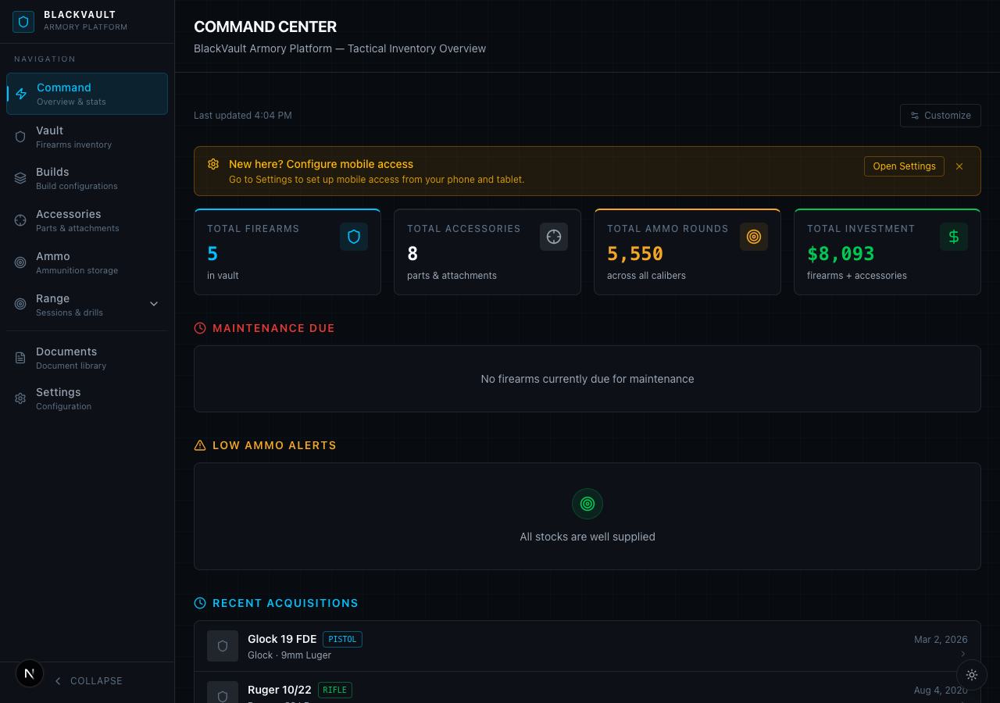
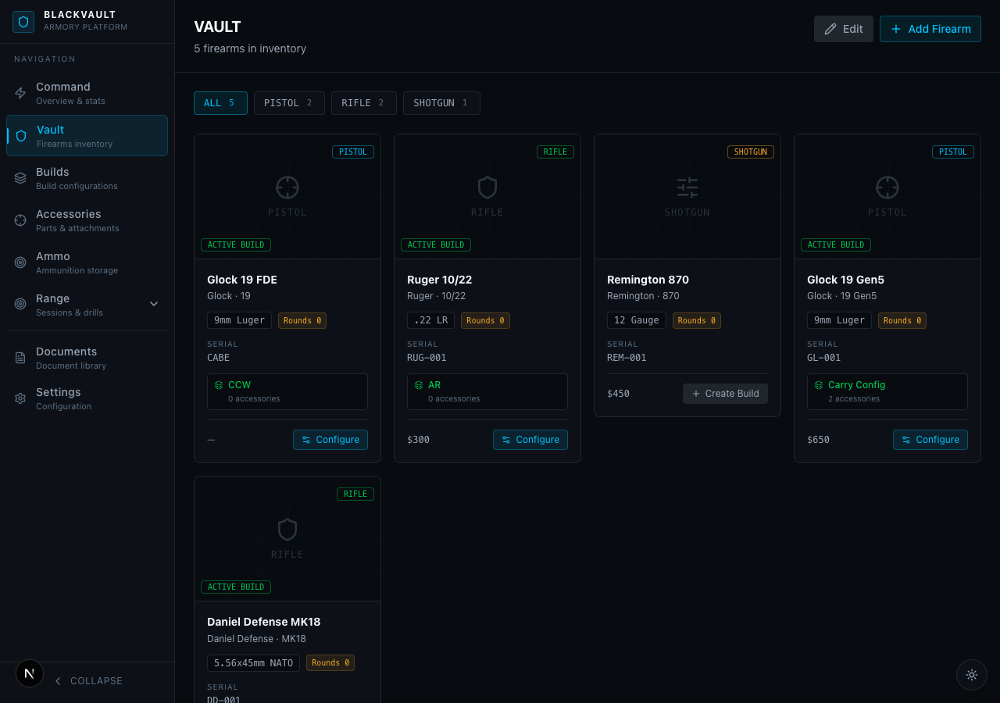
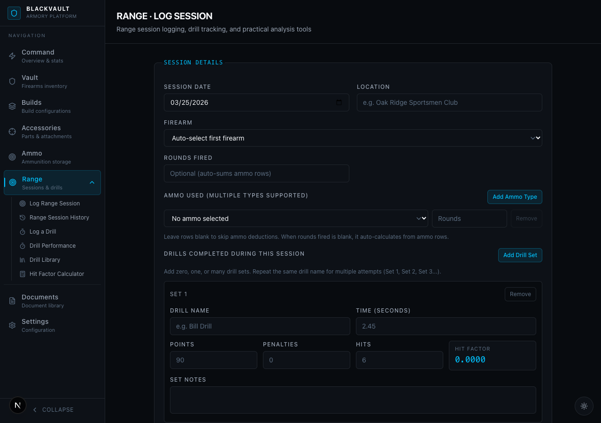
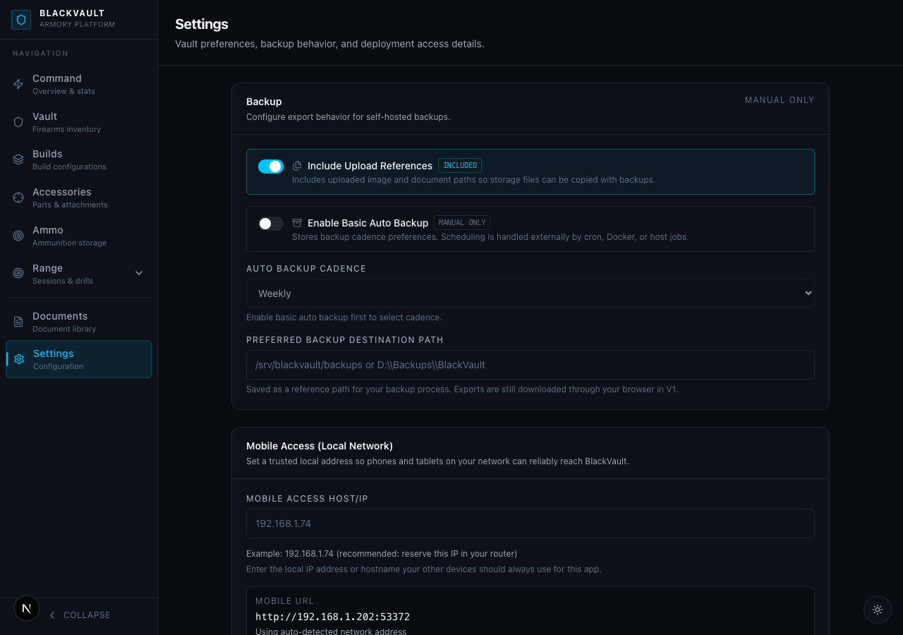

# BlackVault

A self-hosted, local-only web app for tracking firearms, accessories, and range sessions. All data stays on your machine.

---

## Screenshots






---

## Features

- Firearm and accessory tracking
- Document uploads
- Range sessions and drills
- Drill library and history
- Drill logging (standalone or tied to a session)
- Drill performance tracking
- CSV and PDF export
- Dashboard
- Mobile access via local network

---

## Before You Start

**The only thing you need to install is Docker Desktop.** It's free.

| Platform | Download Link |
|----------|--------------|
| 🪟 Windows | [Docker Desktop for Windows](https://docs.docker.com/desktop/setup/install/windows-install/) |
| 🍎 Mac | [Docker Desktop for Mac](https://docs.docker.com/desktop/setup/install/mac-install/) |
| 🐧 Linux | [Docker Engine install guide](https://docs.docker.com/engine/install/) |

After installing, **open Docker Desktop and wait for it to fully load** before continuing.
You'll know it's ready when the whale 🐳 icon appears in your system tray (Windows) or menu bar (Mac).

> ⚠️ **Windows users:** Use `install.bat` — do **not** run `install.sh` and do **not** install Git Bash.
> `install.bat` is the Windows version and does the exact same thing.

---

## Installation — Windows 🪟

### Step 1 — Download BlackVault

Go to the [BlackVault GitHub page](https://github.com/theaveragedeveloper/ProjectBlackVault), click **Code → Download ZIP**, and save it somewhere you'll find it (e.g. your Desktop).

### Step 2 — Extract the ZIP

Right-click the downloaded ZIP and choose **Extract All**. Extract it to a folder like `C:\BlackVault`.

### Step 3 — Run the installer

Open the extracted folder and **double-click `install.bat`**.

> 💡 If it flashes and closes, open **Command Prompt** and run:
> ```cmd
> cd C:\path\to\ProjectBlackVault
> ```
> Then:
> ```cmd
> install.bat
> ```

The installer will ask two questions — press **Enter** to accept the defaults:
- Where to store your data → press Enter
- Which port to use → press Enter

It will then build and start BlackVault. **This can take 5–10 minutes the first time.**

### Step 4 — Open BlackVault

When the installer finishes, open your browser and go to:

```
http://localhost:3000
```

✅ **BlackVault is running.**

---

## Installation — Mac 🍎

### Step 1 — Open Terminal

Press `Cmd + Space`, type `Terminal`, and press Enter.

### Step 2 — Download BlackVault

Copy this command, paste it into Terminal, and press Enter:

```bash
git clone https://github.com/theaveragedeveloper/ProjectBlackVault.git
```

### Step 3 — Go into the folder

```bash
cd ProjectBlackVault
```

### Step 4 — Run the installer

```bash
chmod +x install.sh && ./install.sh
```

The installer will ask two questions — press **Enter** to accept the defaults:
- Where to store your data → press Enter
- Which port to use → press Enter

It will then build and start BlackVault. **This can take 5–10 minutes the first time.**

### Step 5 — Open BlackVault

When the installer finishes, open your browser and go to:

```
http://localhost:3000
```

✅ **BlackVault is running.**

> 💡 **Don't have Git?** Go to the [GitHub page](https://github.com/theaveragedeveloper/ProjectBlackVault), click **Code → Download ZIP**, extract it, open Terminal in that folder, then start from Step 4.

---

## Installation — Linux 🐧

### Step 1 — Open a terminal

### Step 2 — Download BlackVault

```bash
git clone https://github.com/theaveragedeveloper/ProjectBlackVault.git
```

### Step 3 — Go into the folder

```bash
cd ProjectBlackVault
```

### Step 4 — Run the installer

```bash
chmod +x install.sh && ./install.sh
```

The installer will ask two questions — press **Enter** to accept the defaults:
- Where to store your data → press Enter
- Which port to use → press Enter

It will then build and start BlackVault. **This can take 5–10 minutes the first time.**

### Step 5 — Open BlackVault

```
http://localhost:3000
```

✅ **BlackVault is running.**

---

## Stopping and Starting BlackVault

**To stop BlackVault** (your data is never affected):

```bash
docker compose down
```

**To start it again after stopping:**

```bash
docker compose up -d
```

**To update to the latest version:**

Windows — double-click `update.bat`

Mac / Linux:

```bash
./update.sh
```

---

## Troubleshooting

### ❌ Error: "unable to open database file"

This is the most common issue on first launch. It means Docker couldn't create the data folders automatically. Fix it by creating them manually, then restarting.

**Windows — open Command Prompt in the project folder and run these one at a time:**

```cmd
mkdir data\db
```

```cmd
mkdir data\uploads
```

```cmd
docker compose down
```

```cmd
docker compose up -d
```

**Mac / Linux — run these one at a time in Terminal:**

```bash
mkdir -p ./data/db ./data/uploads
```

```bash
docker compose down
```

```bash
docker compose up -d
```

**If the error still appears, check these:**

- Open the `.env` file in the project folder (any text editor). It should contain:
  ```
  DATA_DIR=./data
  PORT=3000
  ```
  If it's missing or blank, paste those two lines in and save.

- **Windows only:** Open Docker Desktop → **Settings → Resources → File Sharing** → make sure the drive your project is on (usually `C:`) is checked → click **Apply & Restart**, then try again.

- **Linux only:** Run this to fix folder permissions:
  ```bash
  sudo chown -R 1001:1001 ./data
  ```

---

### ❌ Windows: `install.sh` won't run / told to install Git Bash

`install.sh` is a Mac/Linux script — it does not work on Windows natively. **Use `install.bat` instead.**

1. Open the project folder in File Explorer
2. Double-click `install.bat`

You do not need Git Bash or WSL. `install.bat` does the exact same thing.

---

### ❌ "Docker is not recognized" / Docker not found

Docker Desktop must be **open and running** before any Docker command will work.

1. Open Docker Desktop from your Start Menu or Applications folder
2. Wait until the whale 🐳 icon appears in your system tray (Windows) or menu bar (Mac)
3. Re-run the installer

---

### ❌ Port 3000 is already in use

Open the `.env` file in the project folder in any text editor. Find this line:

```
PORT=3000
```

Change it to:

```
PORT=3001
```

Save the file, then run:

```bash
docker compose down
```

```bash
docker compose up -d
```

---

### ❌ The app loads but shows no data / database looks empty

Your data is still there — BlackVault is probably pointing at a different folder. **Do not reinstall.**

See **"If two data directories exist"** in the Data & Backups section below.

---

### ❌ App won't load after starting

Check the logs for a specific error message:

```bash
docker compose logs -f
```

Still stuck? Open a [GitHub issue](https://github.com/theaveragedeveloper/ProjectBlackVault/issues) and paste the log output.

---

## Mobile Access (Same Network)

You can open BlackVault on your phone as long as it's on the same Wi-Fi as your computer.

1. Open BlackVault in your browser and go to **Settings**
2. The Settings page will detect your local IP and display a QR code
3. Scan the QR code with your phone

To enter the address manually: run `ipconfig` on Windows or `ip addr` on Mac/Linux to find your IP, then open `http://YOUR_IP:3000` on your phone.

---

## Data & Backups

### Where your data lives

BlackVault stores everything in a `data` folder inside the project directory by default:

```
data/
├── db/
│   └── vault.db        ← your database (all firearms, accessories, sessions)
└── uploads/
    └── ...             ← uploaded images and documents
```

You can change this by editing `DATA_DIR` in the `.env` file before first run.

---

### Backing up your data

**Windows:** Copy the `data` folder to another drive or location in File Explorer.

**Mac / Linux:**

```bash
cp -r ./data ~/blackvault-backup-$(date +%Y%m%d)
```

---

### Updating without losing data

Your data folder is never touched during an update.

**Windows:** Double-click `update.bat`

**Mac / Linux:**

```bash
./update.sh
```

---

### Moving to a new machine

**Step 1 —** Copy your `data` folder to the new machine (USB drive, network share, etc.)

**Step 2 —** Download and extract BlackVault on the new machine

**Step 3 —** Run the installer (`install.bat` or `install.sh`) — when it asks where your data is, point it at the folder you copied

---

### If two data directories exist

This can happen if the installer was run from different locations, or if `docker compose up` was run manually at some point. **No data was deleted** — both databases still exist.

**Step 1 —** Download [DB Browser for SQLite](https://sqlitebrowser.org/) (free) and open each `vault.db` file to see which one has your records.

**Step 2 —** Open `.env` in the project folder and set `DATA_DIR` to the correct path:

```
DATA_DIR=C:\Users\yourname\BlackVault\data
```

**Step 3 —** Restart:

```bash
docker compose down
```

```bash
docker compose up -d
```

---

## Notes

- All data is stored locally on your machine — nothing leaves your network
- No cloud connection is required or used
- There is no login or authentication in V1
- Intended for private, local use only — do not expose it to the public internet

---

## Local Development

```bash
npm install
```

```bash
npx prisma generate
```

```bash
npx prisma db push
```

```bash
npm run dev
```

Open [http://localhost:3000](http://localhost:3000).

---

## License

MIT License. See [LICENSE](LICENSE) for details.
