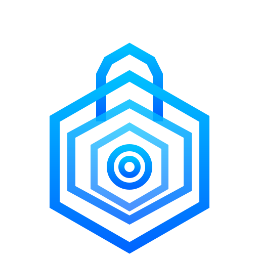

<p align="center">
  
</p>

<h1 align="center">ProjectBlackVault</h1>

<p align="center">
  Your personal, private firearms management app — runs on your own computer, no account or internet required.
</p>

---

## What is ProjectBlackVault?

ProjectBlackVault is a **personal inventory and tracking app** for firearms owners. Think of it like a digital logbook — you can keep track of every gun you own, all your attachments and accessories, your ammunition stockpile, and your range sessions, all in one place.

Everything is stored **on your own computer or home server** — your data never goes to any outside company or cloud service. It's yours, private, and always accessible without an internet connection.

---

## What Can It Do?

| Feature | What it means |
|---------|---------------|
| **Vault** | Keep a record of each firearm — photos, serial numbers, purchase dates, and value |
| **Loadout Builder** | Save different gear configurations for each gun (e.g. hunting setup vs. competition setup) |
| **Accessories** | Track optics, suppressors, grips, triggers, and other attachments |
| **Ammo Inventory** | See how much ammo you have by caliber, with alerts when you're running low |
| **Range Sessions** | Log your time at the range and track round counts through each firearm and part |
| **Training Drills** | Create drill templates, log your results, and track personal records |
| **Documents** | Store manuals, purchase receipts, or any other important paperwork |
| **Statistics & Charts** | See your progress and usage over time at a glance |

---

## Getting Started — Pick Your Method

There are three ways to run ProjectBlackVault. **Choose the one that fits you best:**

---

### Option 1: Desktop App — Easiest (Recommended for most users)

No technical knowledge needed. Just download and run it like any normal application.

**[⬇ Download for your platform →](https://theaveragedeveloper.github.io/ProjectBlackVault/)**

| Your Computer | File to Download |
|---------------|-----------------|
| Windows | `ProjectBlackVault-Setup.exe` |
| Mac | `ProjectBlackVault.dmg` |
| Linux | `ProjectBlackVault-Setup.AppImage` |

**Before you start, you'll need:**
- [Docker Desktop](https://www.docker.com/products/docker-desktop/) — a free program that runs the app in the background. The launcher can **install this automatically** for you on Windows and macOS — just click "Install Docker Automatically" when prompted. Or install it manually first and make sure it's open and running.

**First-time setup tips:**

- **Mac:** If a warning says the app can't be opened, right-click the file and choose **Open** instead of double-clicking.
- **Windows:** If Windows SmartScreen shows a warning, click **More info**, then **Run anyway**.
- **Linux:** Right-click the AppImage file → Properties → mark it as executable, then double-click to run. Or run `chmod +x ProjectBlackVault-Setup.AppImage` in a terminal.

---

### Option 2: Run It Yourself (For developers / technical users)

If you're comfortable with a terminal, you can run the app directly on your machine.

**You'll need:**
- [Node.js](https://nodejs.org/) version 20 or higher
- npm version 9 or higher (comes with Node.js)

**Steps:**

```bash
# 1. Download the code
git clone <repo-url>
cd ProjectBlackVault

# 2. Install the app's dependencies
npm install

# 3. Set up your configuration file
cp .env.example .env
# Open the .env file in a text editor — the default settings work fine for local use

# 4. Set up the database
npx prisma migrate dev

# 5. (Optional) Add some sample data to explore the app
npx prisma db seed

# 6. Start the app
npm run dev
```

Then open your browser and go to **[http://localhost:3000](http://localhost:3000)**

---

### Option 3: Home Server / Docker (For self-hosting enthusiasts)

If you run a home server or NAS and want ProjectBlackVault always available on your network — no desktop launcher needed, any device connects with just a browser.

**One-time setup:**

```bash
# Linux / macOS
git clone https://github.com/theaveragedeveloper/ProjectBlackVault.git
cd ProjectBlackVault
chmod +x install.sh && ./install.sh

# Windows
git clone https://github.com/theaveragedeveloper/ProjectBlackVault.git
cd ProjectBlackVault
install.bat
```

The setup wizard picks a data directory, port, and generates secret keys automatically.

**Day-to-day commands (after setup):**

```bash
# Start the app
docker compose --env-file .blackvault.env up -d

# See what's happening (logs)
docker compose --env-file .blackvault.env logs -f

# Stop the app
docker compose --env-file .blackvault.env down
```

The app automatically handles database setup when it starts. Your data is saved in the directory you chose during setup (default `~/.blackvault`):

- `~/.blackvault/db/` — your database
- `~/.blackvault/uploads/` — your uploaded photos and documents

**Accessing from other devices on your network or VPN:**

1. Find your server's local IP: `ip addr` (Linux), `ipconfig` (Windows), `ifconfig` (macOS)
2. On any other device, open: `http://YOUR-SERVER-IP:3000` — no extra software needed

**Updating:**

```bash
./update.sh    # Linux/macOS
update.bat     # Windows
```

Or inside the app: **Settings → GitHub Updates → Update Now**

> ⚠️ **Back up your encryption key.** It's stored in `.blackvault.env`. If you lose it, all encrypted data (serial numbers, notes) is permanently unrecoverable. Keep a copy somewhere safe. You can also export encrypted backups from inside the app: **Settings → Secure Backup**.

---

## Setting a Password

By default, the app has no password — it's designed for personal use on a trusted network or computer. To add one, go to **Settings** inside the app and set your password from there.

> **Note:** The app password is set inside the app, not in a configuration file.

---

## Configuration (Advanced)

If you're running the app manually or on a server, you can configure it using a `.env` file. Copy `.env.example` to `.env` and edit as needed:

| Setting | Required? | What it does |
|---------|-----------|--------------|
| `DATABASE_URL` | Yes | Where your database file is stored. Default works for local use. |
| `SESSION_SECRET` | Required in production | A secret key that secures your login session. Generate one with: `openssl rand -hex 32` |
| `NODE_ENV` | No | Set to `production` when deploying on a server |
| `PORT` | No | The port the app runs on (default: `3000`) |

> **Security tip:** If you deploy this on a server or expose it outside your home network, make sure to set a strong `SESSION_SECRET` and enable a password in the Settings page. Without `SESSION_SECRET`, the app won't start in production mode.

---

## Having Trouble?

**The app won't open (Mac):**
Right-click the `.dmg` file and choose **Open**. If it still doesn't work, go to System Settings → Privacy & Security and click **Open Anyway**.

**The app won't open (Windows):**
Click **More info** on the SmartScreen warning, then **Run anyway**. The app is safe — Windows just doesn't recognize it because it's not from the Microsoft Store.

**Docker Desktop isn't installed:**
The desktop launcher can install Docker Desktop automatically on Windows and macOS — click "Install Docker Automatically" when prompted. Or [download Docker Desktop here](https://www.docker.com/products/docker-desktop/) manually — it's free. Make sure to open Docker Desktop before launching ProjectBlackVault.

**The page won't load at localhost:3000:**
Make sure the app is still running in your terminal (you should see output from the dev server). If you closed the terminal, run `npm run dev` again.

**My data disappeared:**
If you're running via Docker, your data is in the directory configured during setup (default `~/.blackvault`). If you used `docker compose down -v`, that removes volumes too — avoid the `-v` flag unless you want to wipe everything.

---

## For Developers

<details>
<summary>Tech Stack, Project Structure & Scripts</summary>

### Tech Stack

| Layer | Technology |
|-------|-----------|
| Framework | [Next.js 16](https://nextjs.org) (App Router) |
| Language | TypeScript 5 |
| Database | SQLite via [Prisma ORM](https://www.prisma.io) |
| Styling | [Tailwind CSS v4](https://tailwindcss.com) |
| UI Components | [Radix UI](https://www.radix-ui.com) primitives |
| Icons | [Lucide React](https://lucide.dev) |
| Charts | [Recharts](https://recharts.org) |
| Animation | [Framer Motion](https://www.framer.com/motion) |
| State | [Zustand](https://zustand-demo.pmnd.rs) |
| Validation | [Zod](https://zod.dev) |
| Container | Docker + Docker Compose |

### Project Structure

```
ProjectBlackVault/
├── launcher/               # Electron desktop launcher
│   ├── main.js             # Main process (Docker management, IPC)
│   ├── preload.js          # Context bridge
│   └── renderer/           # Launcher UI
├── docs/
│   └── index.html          # Download landing page (GitHub Pages)
├── prisma/
│   ├── schema.prisma       # Database schema
│   ├── migrations/         # Migration history
│   └── seed.ts             # Sample data seed script
├── src/
│   ├── app/                # Next.js App Router pages & API routes
│   │   ├── api/            # REST API endpoints
│   │   ├── download/       # Launcher download page
│   │   ├── vault/          # Firearm management pages
│   │   ├── accessories/    # Accessory management pages
│   │   ├── builds/         # All loadouts overview
│   │   ├── ammo/           # Ammo inventory pages
│   │   ├── range/          # Range session logging
│   │   └── settings/       # App settings
│   ├── components/         # Shared UI components
│   └── lib/                # Utility functions, Prisma client, types
├── install.sh              # First-run setup wizard (Linux/macOS)
├── install.bat             # First-run setup wizard (Windows)
├── update.sh               # Update script (Linux/macOS)
├── update.bat              # Update script (Windows)
├── docker-compose.yml      # Production compose file
└── Dockerfile
```

### Available Scripts

```bash
npm run dev          # Start development server
npm run build        # Build for production
npm run start        # Run production build
npm test             # Run tests
npm run lint         # Lint code
npm run typecheck    # TypeScript type checking
npm run db:migrate   # Run database migrations
npm run db:seed      # Seed database with sample data
```

### Maintenance: Refresh stale merge-request branches

Use `scripts/refresh-mr-branches.sh` to update old MR branches with the latest target branch.

```bash
# Merge latest main into one or more MR branches
scripts/refresh-mr-branches.sh feature/old-1 feature/old-2

# Rebase workflow (force-with-lease push)
scripts/refresh-mr-branches.sh --rebase -t main mr/legacy-123

# Preview actions only
scripts/refresh-mr-branches.sh --dry-run mr/legacy-123
```

</details>
